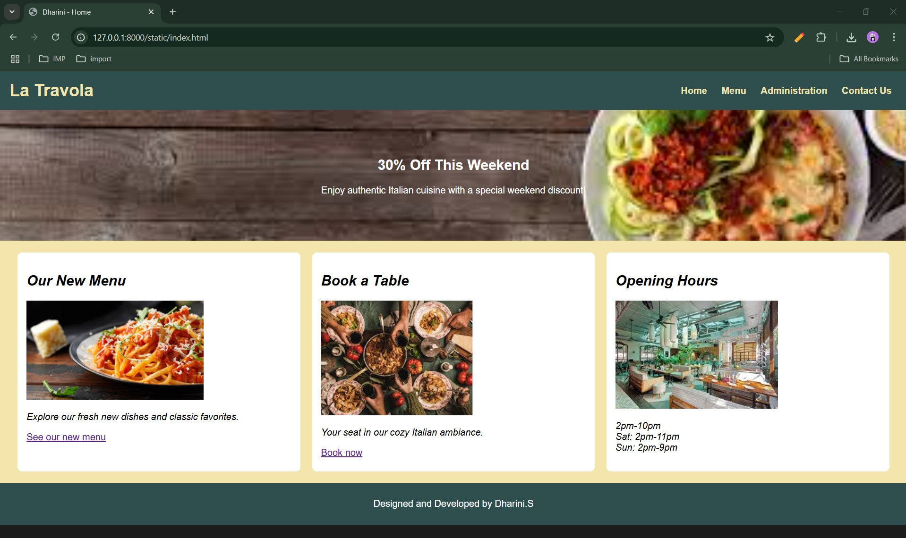
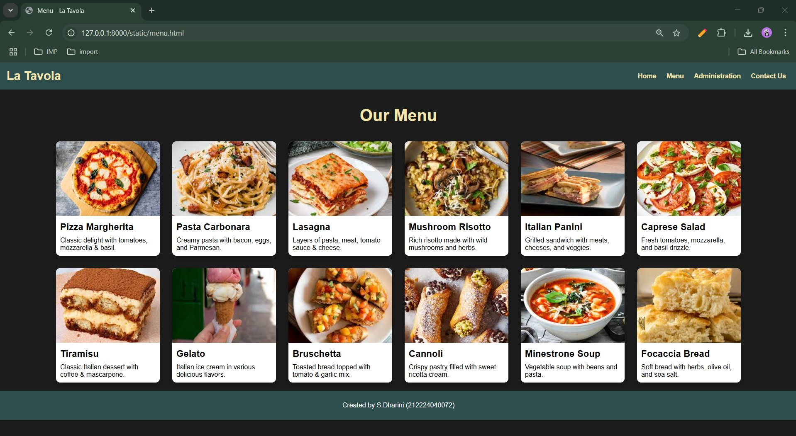
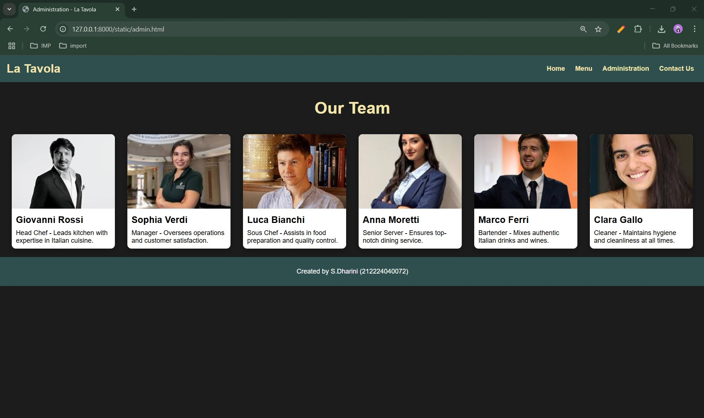
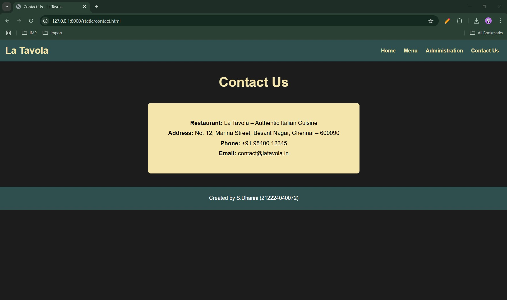

# Ex.07 Restaurant Website
## Date:14.05.2025

## AIM:
To develop a static Restaurant website to display the food items and services provided by them.

## DESIGN STEPS:

### Step 1:
Requirement collection.

### Step 2:
Creating the layout using HTML and CSS.

### Step 3:
Updating the sample content.

### Step 4:
Choose the appropriate style and color scheme.

### Step 5:
Validate the layout in various browsers.

### Step 6:
Validate the HTML code.

### Step 7:
Publish the website in the given URL.

## PROGRAM:

```
index.html

<!DOCTYPE html>
<html lang="en">
<head>
    <meta charset="UTF-8">
    <title>Dharini - Home</title>
    <link rel="stylesheet" href="index.css">
</head>
<body>
    <header>
        <div class="logo">La Travola</div>
        <nav>
            <a href="index.html">Home</a>
            <a href="menu.html">Menu</a>
            <a href="admin.html">Administration</a>
            <a href="contact.html">Contact Us</a>
        </nav>
    </header>
    <section class="banner">
        <h1>30% Off This Weekend</h1>
        <p>Enjoy authentic Italian cuisine with a special weekend discount!</p>
    </section>
    <section class="features">
        <div class="feature-box">
            <h2><i>Our New Menu</i></h2>
            
            <p><i>Explore our fresh new dishes and classic favorites.</i></p>
            <a href="menu.html">See our new menu</a>
        </div>
        <div class="feature-box">
            <h2><i>Book a Table</i></h2>
            
            <p><i>Your seat in our cozy Italian ambiance.</i></p>
            <a href="contact.html">Book now</a>
        </div>
        <div class="feature-box">
            <h2><i>Opening Hours</i></h2>
            
            <p><i>2pm-10pm<br>Sat: 2pm-11pm<br>Sun: 2pm-9pm</i></p>
        </div>
    </section>
    <footer>
        <p>Designed and Developed by Dharini.S</p>
    </footer>
</body>
</html>

index.css


body {
    margin: 0;
    font-family: Arial, sans-serif;
    background-color: #1C1C1C;
    color: #FFFFFF;
}
header {
    background-color: #2F4F4F;
    padding: 1rem;
    display: flex;
    justify-content: space-between;
    align-items: center;
}
.logo {
    font-size: 1.8rem;
    font-weight: bold;
    color: #F3E5AB;
}
nav a {
    margin: 0 10px;
    color: #F3E5AB;
    text-decoration: none;
    font-weight: bold;
}
.banner {
    background: url('images/banner.jpg') no-repeat center center/cover;
    padding: 60px 20px;
    text-align: center;
    color: #FFFFFF;
}
.features {
    display: flex;
    justify-content: space-around;
    padding: 20px;
    background-color: #F3E5AB;
    color: #000;
}
.feature-box {
    width: 30%;
    background-color: #fff;
    padding: 15px;
    border-radius: 8px;
    color: #000;
}
footer {
    background-color: #2F4F4F;
    text-align: center;
    padding: 10px;
    color: white;
}

admin.html

<!DOCTYPE html>
<html lang="en">
<head>
  <meta charset="UTF-8">
  <title>Administration - La Tavola</title>
  <link rel="stylesheet" href="style.css">
</head>
<body>
  <header>
    <div class="logo">La Tavola</div>
    <nav>
      <a href="index.html">Home</a>
      <a href="menu.html">Menu</a>
      <a href="admin.html">Administration</a>
      <a href="contact.html">Contact Us</a>
    </nav>
  </header>

  <h2 class="section-title">Our Team</h2>
  <section class="content-wrapper">
    <div class="box">
      
      <h3>Giovanni Rossi</h3>
      <p>Head Chef - Leads kitchen with expertise in Italian cuisine.</p>
    </div>
    <div class="box">
      
      <h3>Sophia Verdi</h3>
      <p>Manager - Oversees operations and customer satisfaction.</p>
    </div>
    <div class="box">
      
      <h3>Luca Bianchi</h3>
      <p>Sous Chef - Assists in food preparation and quality control.</p>
    </div>
    <div class="box">
      
      <h3>Anna Moretti</h3>
      <p>Senior Server - Ensures top-notch dining service.</p>
    </div>
    <div class="box">
      
      <h3>Marco Ferri</h3>
      <p>Bartender - Mixes authentic Italian drinks and wines.</p>
    </div>
    <div class="box">
      
      <h3>Clara Gallo</h3>
      <p>Cleaner - Maintains hygiene and cleanliness at all times.</p>
    </div>
  </section>

  <footer>
    <p>Created by S.Dharini (212224040072)</p>
  </footer>
</body>
</html>


menu.html

<!DOCTYPE html>
<html lang="en">
<head>
  <meta charset="UTF-8">
  <title>Menu - La Tavola</title>
  <link rel="stylesheet" href="style.css">
</head>
<body>
  <header>
    <div class="logo">La Tavola</div>
    <nav>
      <a href="index.html">Home</a>
      <a href="menu.html">Menu</a>
      <a href="admin.html">Administration</a>
      <a href="contact.html">Contact Us</a>
    </nav>
  </header>

  <h2 class="section-title">Our Menu</h2>
  <section class="content-wrapper">
    <div class="box">
      
      <h3>Pizza Margherita</h3>
      <p>Classic delight with tomatoes, mozzarella & basil.</p>
    </div>
    <div class="box">
      
      <h3>Pasta Carbonara</h3>
      <p>Creamy pasta with bacon, eggs, and Parmesan.</p>
    </div>
    <div class="box">
      
      <h3>Lasagna</h3>
      <p>Layers of pasta, meat, tomato sauce & cheese.</p>
    </div>
    <div class="box">
      
      <h3>Mushroom Risotto</h3>
      <p>Rich risotto made with wild mushrooms and herbs.</p>
    </div>
    <div class="box">
      
      <h3>Italian Panini</h3>
      <p>Grilled sandwich with meats, cheeses, and veggies.</p>
    </div>
    <div class="box">
      
      <h3>Caprese Salad</h3>
      <p>Fresh tomatoes, mozzarella, and basil drizzle.</p>
    </div>
    <div class="box">
      
      <h3>Tiramisu</h3>
      <p>Classic Italian dessert with coffee & mascarpone.</p>
    </div>
    <div class="box">
      
      <h3>Gelato</h3>
      <p>Italian ice cream in various delicious flavors.</p>
    </div>
    <div class="box">
      
      <h3>Bruschetta</h3>
      <p>Toasted bread topped with tomato & garlic mix.</p>
    </div>
    <div class="box">
      
      <h3>Cannoli</h3>
      <p>Crispy pastry filled with sweet ricotta cream.</p>
    </div>
    <div class="box">
      
      <h3>Minestrone Soup</h3>
      <p>Vegetable soup with beans and pasta.</p>
    </div>
    <div class="box">
      
      <h3>Focaccia Bread</h3>
      <p>Soft bread with herbs, olive oil, and sea salt.</p>
    </div>
  </section>

  <footer>
    <p>Created by S.Dharini (212224040072)</p>
  </footer>
</body>
</html>


contact.html

<!DOCTYPE html>
<html lang="en">
<head>
  <meta charset="UTF-8">
  <title>Contact Us - La Tavola</title>
  <link rel="stylesheet" href="style.css">
</head>
<body>
  <header>
    <div class="logo">La Tavola</div>
    <nav>
      <a href="index.html">Home</a>
      <a href="menu.html">Menu</a>
      <a href="admin.html">Administration</a>
      <a href="contact.html">Contact Us</a>
    </nav>
  </header>

  <h2 class="section-title">Contact Us</h2>
  <div class="contact-info">
    <p><strong>Restaurant:</strong> La Tavola – Authentic Italian Cuisine</p>
    <p><strong>Address:</strong> No. 12, Marina Street, Besant Nagar, Chennai – 600090</p>
    <p><strong>Phone:</strong> +91 98400 12345</p>
    <p><strong>Email:</strong> contact@latavola.in</p>
  </div>

  <footer>
    <p>Created by S.Dharini (212224040072)</p>
  </footer>
</body>
</html>

style.css

/* General Styles */
body {
    margin: 0;
    font-family: Arial, sans-serif;
    background-color: #1C1C1C;
    color: #FFFFFF;
}

/* Header */
header {
    background-color: #2F4F4F;
    padding: 1rem;
    display: flex;
    justify-content: space-between;
    align-items: center;
}

.logo {
    font-size: 1.8rem;
    font-weight: bold;
    color: #F3E5AB;
}

nav a {
    margin: 0 10px;
    color: #F3E5AB;
    text-decoration: none;
    font-weight: bold;
}

nav a:hover {
    text-decoration: underline;
}

/* Footer */
footer {
    background-color: #2F4F4F;
    text-align: center;
    padding: 10px;
    color: white;
}

/* Shared Section Styles */
.section-title {
    text-align: center;
    font-size: 2.5rem;
    color: #F3E5AB;
    margin-top: 40px;
    margin-bottom: 20px;
}

.content-wrapper {
    display: flex;
    flex-wrap: wrap;
    justify-content: center;
    gap: 30px;
    padding: 20px;
}

/* Boxed Image Style (Common) */
.box {
    background-color: #FFFFFF;
    color: #000;
    width: 250px;
    border-radius: 10px;
    overflow: hidden;
    box-shadow: 0 4px 15px rgba(0,0,0,0.3);
    transition: transform 0.3s ease;
}

.box:hover {
    transform: scale(1.05);
}

.box img {
    width: 100%;
    height: 180px;
    object-fit: cover;
}

.box h3 {
    font-size: 1.4rem;
    margin: 10px;
}

.box p {
    font-size: 1rem;
    margin: 10px;
}

/* Contact Info */
.contact-info {
    text-align: center;
    padding: 40px 20px;
    background-color: #F3E5AB;
    color: #000;
    border-radius: 8px;
    margin: 40px auto;
    max-width: 600px;
}

.contact-info p {
    margin: 10px 0;
    font-size: 1.1rem;
}

/* Responsive */
@media (max-width: 768px) {
    .content-wrapper {
        flex-direction: column;
        align-items: center;
    }

    .box {
        width: 80%;
    }

    .feature-box {
        width: 90%;
    }
}


```
## OUTPUT:





## RESULT:
The program for designing software company website using HTML and CSS is completed successfully.
